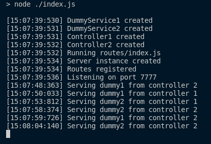

# Express Toy App with Singleton Pattern

## What is the Singleton Pattern?

In _Design Patterns: Elements of Reusable Object-Oriented Software_, the Gang of Four define the _Singleton Pattern_ as a creational pattern where a class has only one instance during the whole execution of the program. The class in which the singleton pattern is used keeps a reference of its instance, and intercepts any requests to create a new object, returning the existing instance if it exists or creating an instance durying the first call.

## Singleton Pattern in Express' Context

In the context of a Node.JS Express application, the Singleton Pattern is useful to avoid creating multiple instances of a class in memory, which helps to reduce the memory footprint. By creating a class for each **controller** and a class for each **service**, all controllers registered in any route and all services referenced by any controllers are created during startup and reused in the process' lifespan.

## Execution

One may be interested in see the pattern in action. Just clone this repo in your local machine and execute `npm i` followed by `npm start` (or `yarn` equivalents). Once started, you'll be able to see logged in the console all the creations happening during startup. Firing requests to any endpoint registered in the application will not generate any new **controller** or **service** instance.

The image below shows an execution sample

## References

GAMMA, E., HELM, R., JOHNSON, R. E., & VLISSIDES, J. **Design patterns: elements of reusable object-oriented software.** 1st Edition. Bookman, 1995.
